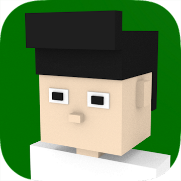
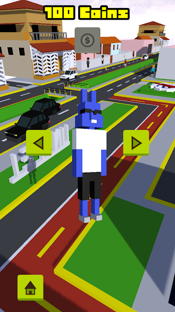
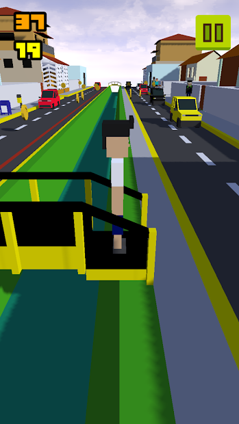
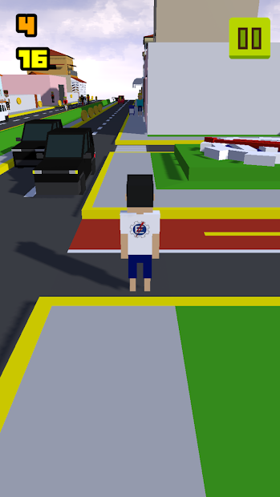

<h1 align="center">
  Endless BPS
</h1>

Jogo de endless running feito na Unreal Engine 4.

Parabéns! Você é um bixo e acaba de entrar na melhor universidade do brasil, a UNIFEI, porem como todo bom bixo você é burro e não sabe o caminho para sua república, agora bebe pinga bixo.

Divirta-se jogando pela avenida BPS onde verá várias referências.

O jogo possui sistema de ranking para disputar contra outros jogadores. No menu de pause durante o jogo pode ser encontrado missões que lhe darão pontos extras para subir no ranking. Com as moedas de ouro podem ser compradas skins na lojinha.

Jogo sem fins lucrativos, sem compra digital e sem propagandas, totalmente gratuito e utilizado para fins acadêmicos.

## Download
O download pode ser encontrado na [Google Play](https://play.google.com/store/apps/details?id=com.devu.endlessbps).

## Screenshots

## Programas utilizados
- Unreal Engine 4.20.1
- Blender 2.7.9b 
- Krita 4.1.0

## Licença
Todos os modelos 3D são de autoria própria e podem ser utilizados para qualquer fim.